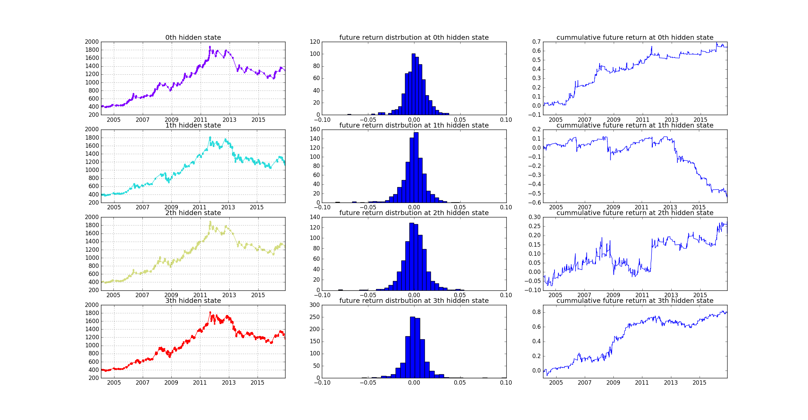
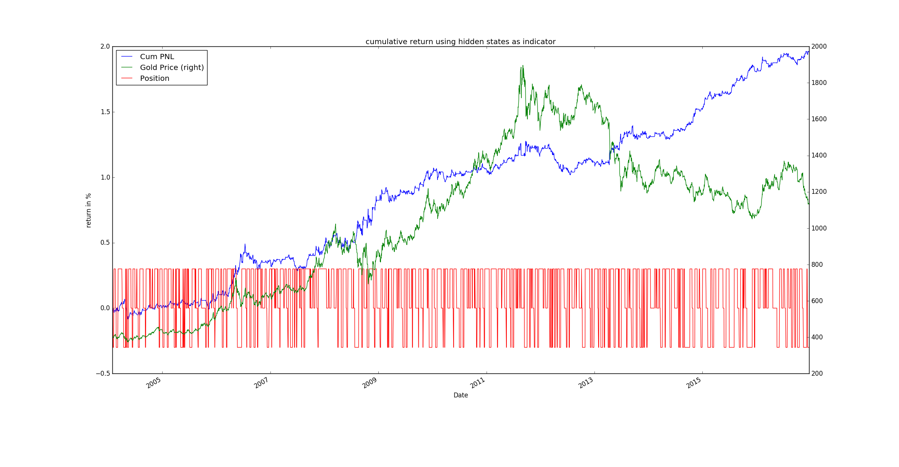

# XAUUSD HMM Trend Following Strategy

This is a strategy using linear regression across multiple time horizon as
indicators and Hidden Markov Model to detect the possible hidden state of the market.

Trend following strategy need to use assets which have high momentum. I choose
XAUUSD since the market has been driven most by fundamental investments.

# Hidden State Detecting Result
  * Hidden state 0 is identified as up Trend. It has weaker performance after 2013 since the market is bearish compared to before   

  * Hidden state 1 is identified as down Trend. Before 2013 it swing up and down because it was a big bull market to gold. However
  after 2013 it perform well because the market is in bearish situation.

  * Hidden state 2 is identified as no specific trend. The Gaussian Markov Model has big variance in estimated trend. Do not enter any
  trader during this state.

  * Hidden state 3 is identified as reversion trend. It has more unclear trend in 20-days time horizon. However gradually have
  clearer upward trending as we move closer to the current day

# Long Short Result Using Predicted Hidden State

