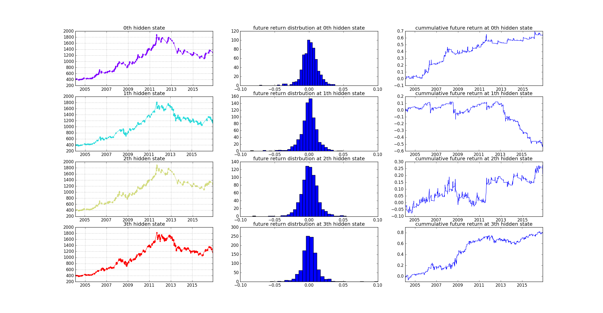
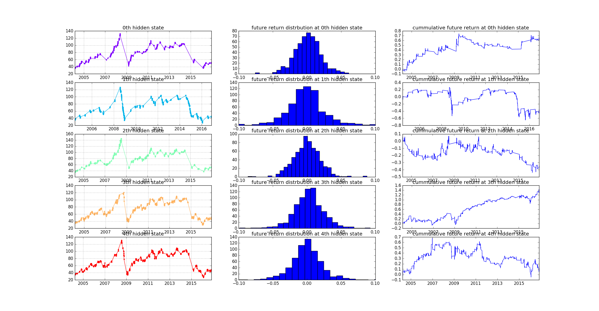
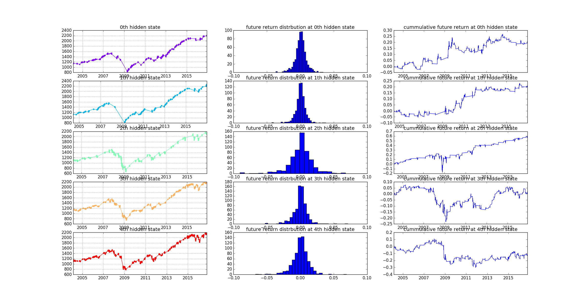
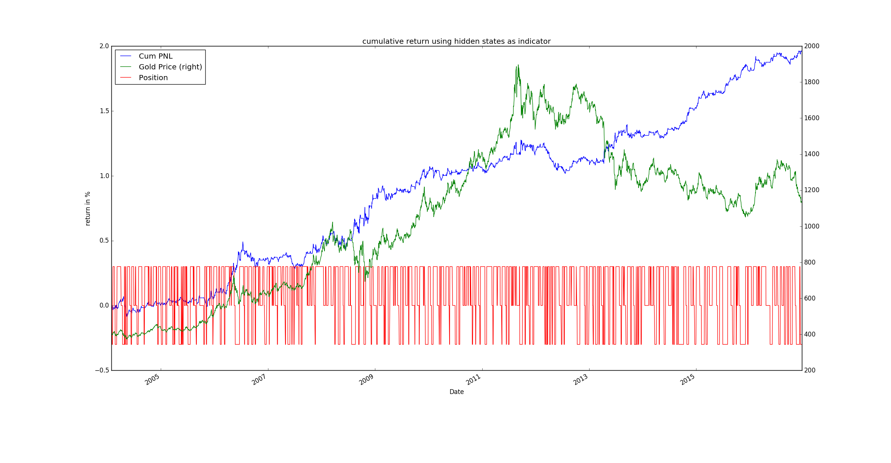
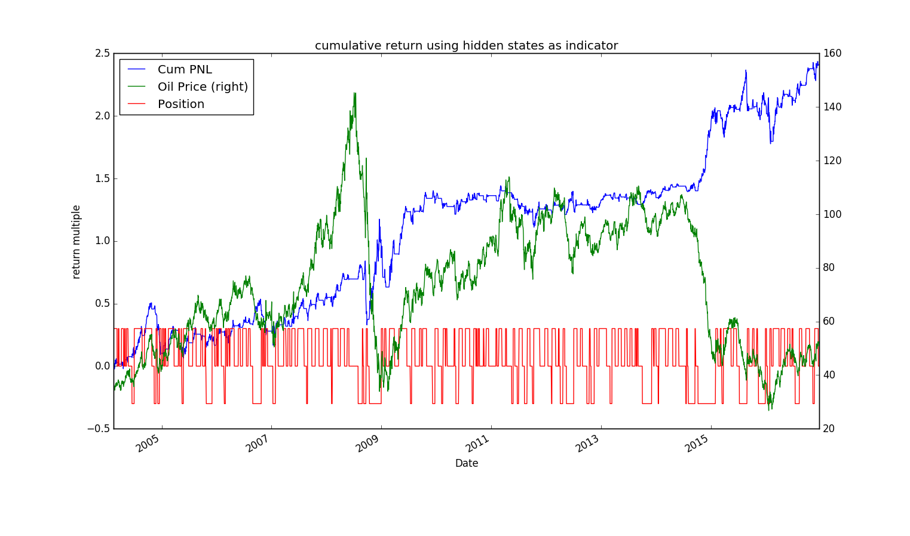
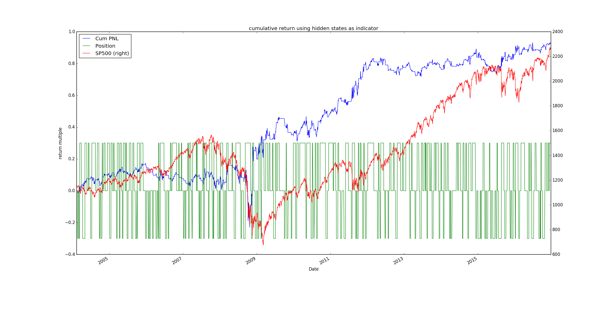

# Commodities HMM Trend-Follow Strategy

This is a strategy using linear regression across multiple time horizon as
indicators and Hidden Markov Model to detect the possible hidden state of the market.

Trend following strategy need to use assets which have high momentum. I choose
XAUUSD and NYMEX Crude Oil since the market has been driven most by fundamental investments.

As a comparison. SP500 lacks of specific trend compare to commodities, which does not produce a very robust result
(The 2009 stock flash crash gives a pattern which can't be learned by HMM).

# Hidden State Detection
## XAUUSD

  * Hidden state 0 is identified as up-trend. It has weaker performance after 2013 since the market is bearish compared to before   

  * Hidden state 1 is identified as down-trend. Before 2013 it swing up and down because it was a big bull market to gold. However
  after 2013 it perform well because the market is in bearish situation.

  * Hidden state 2 is identified as no specific trend. The Gaussian Markov Model has big variance in estimated trend. Do not enter any
  trade during this state.

  * Hidden state 3 is identified as reverse-trend. It has more unclear trend in 20-days time horizon. However gradually have
  clearer upward trending as we move closer to the current day

## CME_CL1(Crude Oil)

* Hidden state 0 is identified as up-trend.   

* Hidden state 1 is identified as down-trend.

* Hidden state 2 is identified as no specific trend.

* Hidden state 3 is identified as reverse_up_trend.

* Hidden state 4 is identified as reverse_down_trend.

## SP500

* Hidden state 0 is identified as no-trend.   

* Hidden state 1 is identified as up-trend.

* Hidden state 2 is identified as reverse_up_trend.

* Hidden state 3 is identified as no-trend.

* Hidden state 4 is identified as down_trend.

# Long Short Using Predicted Hidden State

## XAUUSD

## CME_CL1

## SP500

